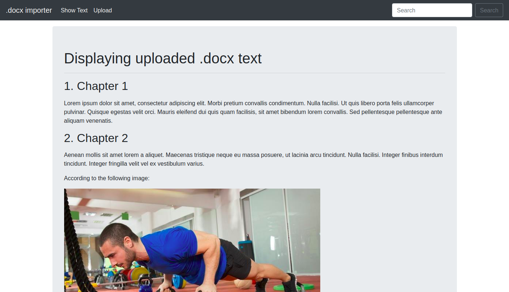

# A web page for displaying text uploaded from a .docx file

This is a web page built using Django and SQLite3 that shows text and images imported from a .docx file. It uses python-docx module to manage import and inkscape for converting .emf images to .svg.



## Follow the steps to run this project:

1. Clone this repository and create a virtual-env in the same directory
```sh
git clone https://github.com/thalescr/django-docx-import.git
cd django-docx-import
python3 -m venv venv
```

2. Activate your virtual-env:

Windows:
```sh
venv\Scripts\activate
```

Linux:
```sh
source venv/bin/activate
```

3. Install required Python modules
```sh
pip3 install -r requirements.txt
```

4. Finally run your server
```sh
python3 manage.py runserver
```
